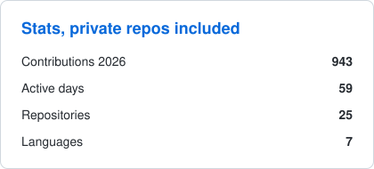
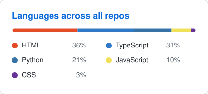

# Sami Magdouli

Co-founder &amp; CTO at NTA · Building Emil, my own AI assistant · Berlin, coding since 2020

### Building

| | |
|---|---|
| **NTA** | Learning app for students with dyslexia. Next.js, Claude API, self hosted on my own VPS. |
| **Emil** | Personal AI assistant on WhatsApp and Telegram: one orchestrator, nine specialist agents, runs my mail and calendar. Public part: [scraping-agent-skeleton](https://github.com/sami-mag07/scraping-agent-skeleton) |
| **ParkIt** | What parking in Berlin actually costs right now. [App](https://github.com/sami-mag07/ParkIt) · [Web](https://github.com/sami-mag07/parkit-web) |
| **Beacon** | Crisis cockpit for winter blackouts, built at European Defense Tech Week Berlin 2026. |
| **AI workshops** | Ran workshops for teachers at my school. [Handouts](https://github.com/sami-mag07/ki-workshop-handouts) · [Fact checker](https://github.com/sami-mag07/ki-faktencheck) |

### Stack

### Stats

<picture>
  <source media="(prefers-color-scheme: dark)" srcset="stats-dark.svg">
  
</picture>
<picture>
  <source media="(prefers-color-scheme: dark)" srcset="langs-dark.svg">
  
</picture>

Cards are generated from all 25 repositories, private ones included, by <a href="stats.py">stats.py</a>.
